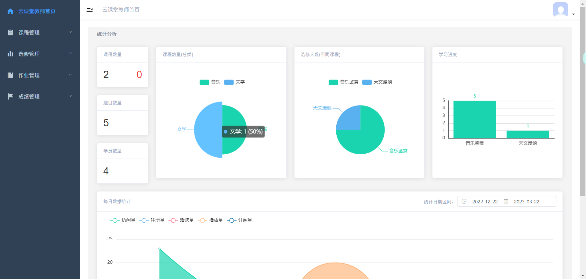
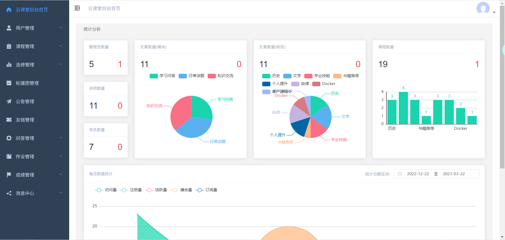

#### 介绍
基于SpringBoot+vue的在线学习平台(学生端、教师端、管理端)，学生借助平台在线学习和交流，并且教师通过学分制的来衡量学生的学习质量。 

#### 技术栈
**(前端)vue+(后端)springboot** 
学生端技术：Vue （包含首页、选修课、学习中心、讲师、问答、我的作业、我的通知、个人中心等界面。）

教师端技术：vue+Element-UI （包含我的课程管理、选修管理、作业管理、成绩管理等界面。）

管理端技术：vue+Element-UI （包含用户管理、课程管理、选修管理、轮播图管理、公告管理、友链管理、问答管理、作业管理、成绩管理、消息管理等界面。）

后端：springboot

#### 查看运行效果
[演示地址](http://123.56.144.92:8001/front/dist/index.html)

#### 当前项目源代码
学生端源码：https://gitee.com/wttAndroid/online-learning-platform

教师端源码：有偿源码

管理端源码：有偿源码

资料：开题报告、开题答辩ppt、中期小结、论文大纲、论文模板等

#### 部分页面展示

#### 安装教程
npm install 下载相关依赖

npm run serve 运行

npm run build 打包

#### 联系我：远程调试/二次开发/毕设

 
